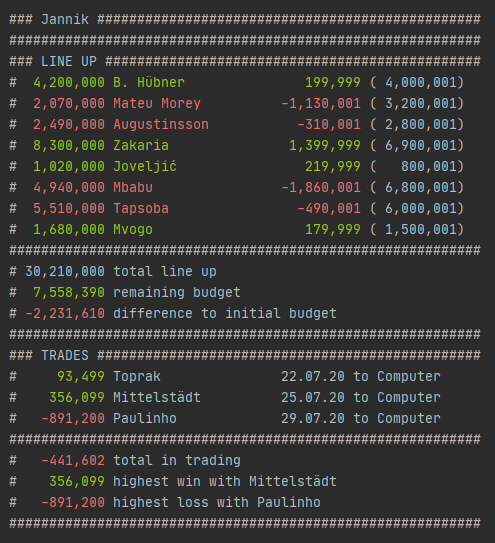

# comalyzer

## Summary
This script runs some statistical analysis on your [comunio](https://de.wikipedia.org/wiki/Comunio) community.

The output is displayed to the console:

### Currently tracked data
#### Line up
Player:
- current market value
- name of player
- difference compared to purchase price
- purchase price

Manager:
- current total market value of line up
- current account balance of manager (remaining budget)
- difference between initial budget and (total market value + balance)

#### Trades
Per trade:
- realized profit or loss
- name of sold player
- date of sale
- name of buyer

Per manager:
- sum of all profits and losses
- highest profit
- highest loss

## How to use
Change the values stored in `config.py` according to your needs. Especially the `COMMUNITY_ID` which can be either hardcoded or stored as an environment variable called `COMUNIO_COMMUNITY_ID`.

Then start the script using `python comalyzer.py` or by double clicking on the `comalyzer.bat` file.

## How it works
The script uses [comunio's SOAP interface](https://www.comunio.de/soapservice.php?wsdl) to access the news of a specified community. The news get stored locally in a file called `news_dump.txt`. Also the date of the latest news posting gets stored in a file called `news_dump_date.txt`.
Then the news get parsed to extract and store data like the manager id, purchase price and player name. Everytime you run the script, it checks if there are more recent news than the ones already stored and retrieves them. It also checks for the current market values of all relevant players. With this data pool the aforementioned statistics can be computed and printed to the console.

## Known issues
- If you try to run the script in IDLE you will see some ugly output because coloroma (colored console output) does not work there. However it works well in Windows cmd or the PyCharm terminal.